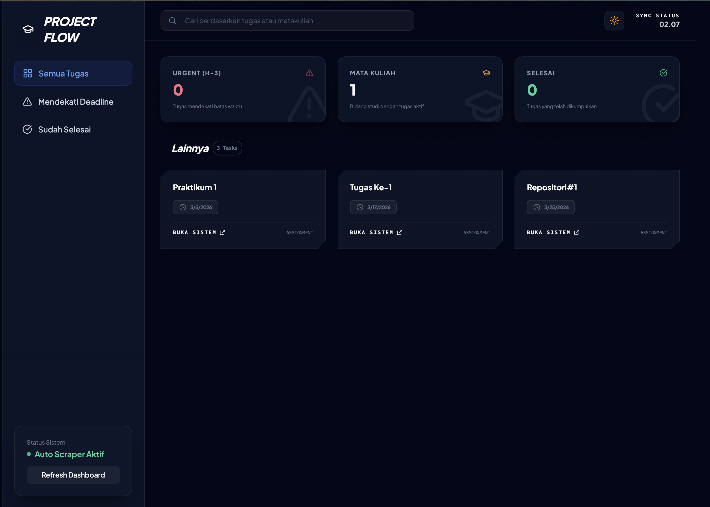

# 🎓 Kulino Flow - Udinus Dashboard

Kulino Flow adalah dashboard modern, cerdas, dan futuristik untuk mahasiswa Universitas Dian Nuswantoro (Udinus). Dirancang untuk memantau tugas, praktikum, dan materi kuliah secara realtime dengan estetika Arknights: Endfield x macOS Crystal.

## ✨ Fitur Utama
- 🛡️ **Scraping Otomatis**: Mengambil data tugas dan materi langsung dari Kulino Udinus.
- ⏰ **Deep Deadline Detection**: Deteksi deadline hingga ke dalam detail link tugas secara otomatis.
- 🚨 **H-3 Urgent Warning**: Notifikasi visual untuk tugas yang akan berakhir dalam 3 hari.
- 🌓 **Dual Theme System**: Dukungan Mode Gelap (Deep Space) dan Mode Terang (Crystal Mist).

## 📸 Tampilan Dashboard

*Tampilan Clean dan Elegant dalam Dark Mode*

## 🚀 Persiapan Instalasi

1. **Clone Repository**
   ```bash
   git clone https://github.com/ryuarnovi/kulino-schedule.git
   cd kulino-schedule
   ```

2. **Install Dependensi**
   ```bash
   npm install
   ```

3. **Konfigurasi Environment**
   Buat file `.env` di root direktori dan isi dengan akun Kulino Anda:
   ```env
   KULINO_USERNAME=A11.202x.xxxxx
   KULINO_PASSWORD=password_anda
   ```

4. **Jalankan Aplikasi**
   ```bash
   npm start
   ```
   Buka `http://localhost:3000` di browser Anda.

## 🛠️ Tech Stack
- **Backend**: Node.js, Express
- **Scraper**: Playwright (Chromium)
- **Frontend**: HTML5, Vanilla CSS, Tailwind CSS (Design Tokens)
- **Icons**: Lucide Icons
- **Fonts**: Plus Jakarta Sans

## 🔐 Keamanan
Aplikasi ini tidak menyimpan kredensial Anda di server luar. Akun Anda hanya digunakan secara lokal (atau di server deployment Anda sendiri seperti Vercel) untuk berinteraksi dengan website Kulino secara otomatis.

## 🛡️ Guard Protocol (Branch Protection)

Untuk memastikan tidak ada yang melakukan `push` sembarangan tanpa request/verifikasi, ikuti langkah-langkah berikut di **GitHub Settings**:

1.  Buka repository di GitHub.
2.  Pergi ke **Settings** > **Branches**.
3.  Klik **Add branch protection rule**.
4.  **Branch name pattern**: Isi dengan `main`.
5.  Centang **Require a pull request before merging**: 
    - Ini akan memaksa semua perubahan harus lewat "Request" (Pull Request).
6.  Centang **Require status checks to pass before merging**:
    - Cari dan pilih `Logic Protection Gate` (ini adalah pengecekan otomatis yang saya buat).
7.  Centang **Do not allow bypassing the above settings**: Agar peraturan ini berlaku untuk semua orang (termasuk admin).
8.  Klik **Create**.

Dengan ini, repositori Anda terlindungi dari perubahan yang tidak disengaja.

---
Dibuat dengan ❤️ untuk mahasiswa Udinus.
